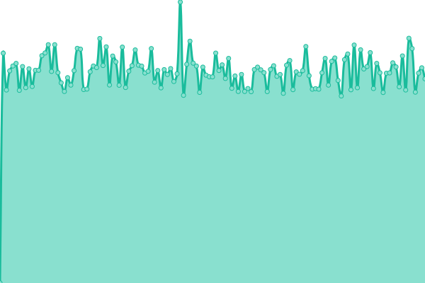
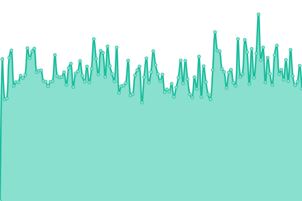
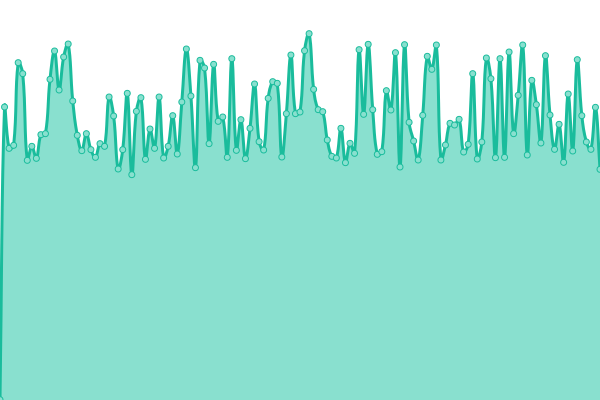
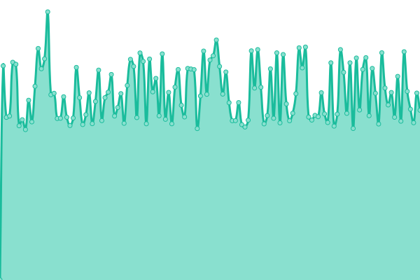
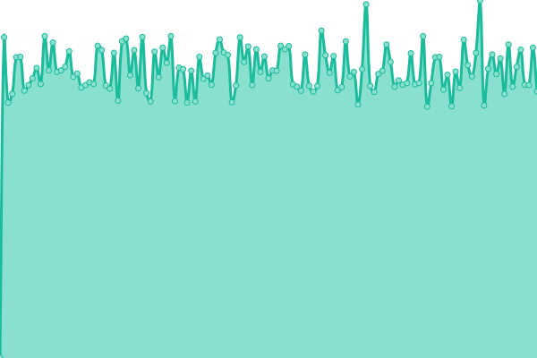
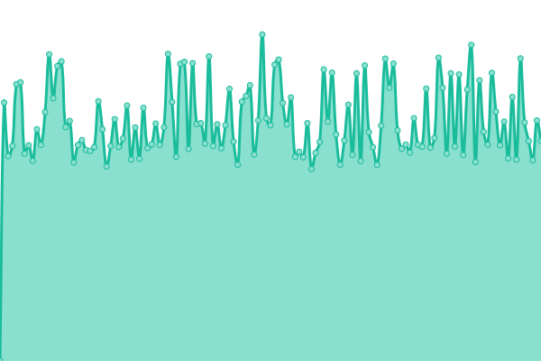

# [📈 Live Status](https://SRESchool.github.io/All-Professnow-Websites-Uptime-Monitor): <!--live status--> **🟧 Partial outage**

This repository contains the open-source uptime monitor and status page for [SRESchool](https://SRESchool.github.io/All-Professnow-Websites-Uptime-Monitor), powered by [Upptime](https://github.com/upptime/upptime).

With [Upptime](https://upptime.js.org), you can get your own unlimited and free uptime monitor and status page, powered entirely by a GitHub repository. We use [Issues](https://github.com/SRESchool/All-Professnow-Websites-Uptime-Monitor/issues) as incident reports, [Actions](https://github.com/SRESchool/All-Professnow-Websites-Uptime-Monitor/actions) as uptime monitors, and [Pages](https://SRESchool.github.io/All-Professnow-Websites-Uptime-Monitor) for the status page.

<!--start: status pages-->
<!-- This summary is generated by Upptime (https://github.com/upptime/upptime) -->
<!-- Do not edit this manually, your changes will be overwritten -->
<!-- prettier-ignore -->
| URL | Status | History | Response Time | Uptime |
| --- | ------ | ------- | ------------- | ------ |
|  [Professnow](https://professnow.com) | 🟩 Up | [professnow.yml](https://github.com/SRESchool/All-professnow-Websites-Uptime-Monitor/commits/HEAD/history/professnow.yml) | 

 1887ms
     
 | 

<a href="https://SRESchool.github.io/All-Professnow-Websites-Uptime-Monitor/history/professnow">37.78%</a>
    

|  [IReviewed](https://ireviewed.in) | 🟩 Up | [i-reviewed.yml](https://github.com/SRESchool/All-professnow-Websites-Uptime-Monitor/commits/HEAD/history/i-reviewed.yml) | 

 2955ms
     
 | 

<a href="https://SRESchool.github.io/All-Professnow-Websites-Uptime-Monitor/history/i-reviewed">100.00%</a>
    

|  [WakilSahab](https://wakilsahab.in) | 🟩 Up | [wakil-sahab.yml](https://github.com/SRESchool/All-professnow-Websites-Uptime-Monitor/commits/HEAD/history/wakil-sahab.yml) | 

 982ms
     
 | 

<a href="https://SRESchool.github.io/All-Professnow-Websites-Uptime-Monitor/history/wakil-sahab">100.00%</a>
    

|  [AstroPilot](https://astropilot.co) | 🟩 Up | [astro-pilot.yml](https://github.com/SRESchool/All-professnow-Websites-Uptime-Monitor/commits/HEAD/history/astro-pilot.yml) | 

 2424ms
     
 | 

<a href="https://SRESchool.github.io/All-Professnow-Websites-Uptime-Monitor/history/astro-pilot">100.00%</a>
    

|  [DroneSnow](https://dronesnow.in) | 🟥 Down | [drone-snow.yml](https://github.com/SRESchool/All-professnow-Websites-Uptime-Monitor/commits/HEAD/history/drone-snow.yml) | 

 0ms
     
 | 

<a href="https://SRESchool.github.io/All-Professnow-Websites-Uptime-Monitor/history/drone-snow">0.00%</a>
    

|  [DesiNRI](https://desinri.com) | 🟩 Up | [desi-nri.yml](https://github.com/SRESchool/All-professnow-Websites-Uptime-Monitor/commits/HEAD/history/desi-nri.yml) | 

 1185ms
     
 | 

<a href="https://SRESchool.github.io/All-Professnow-Websites-Uptime-Monitor/history/desi-nri">59.39%</a>
    

<!--end: status pages-->

[**Visit our status website →**](https://SRESchool.github.io/All-Professnow-Websites-Uptime-Monitor)

## 📄 License

- Powered by: [Upptime](https://github.com/upptime/upptime)
- Code: [MIT](./LICENSE) © [Anand Chowdhary](https://anandchowdhary.com), supported by [Pabio](https://pabio.com)
- Data in the `./history` directory: [Open Database License](https://opendatacommons.org/licenses/odbl/1-0/)
